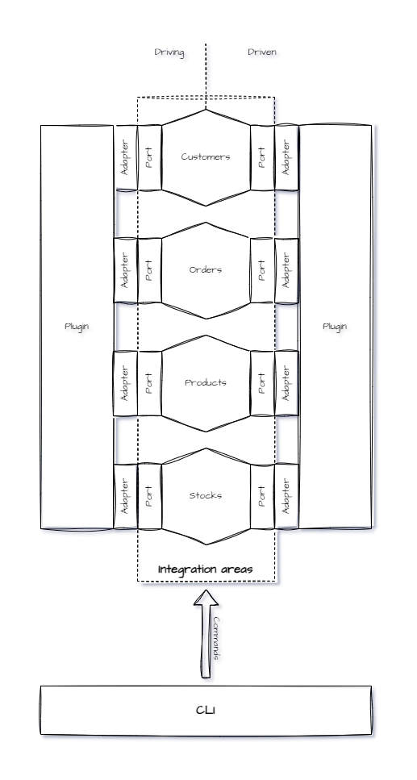

Schema below presents big picture of Integrify architecture approach:

Main concept for this project is use a **hexagonal architecture**.
You can see some elements from this approach, like **ports** and **adapters**.
Each integration area is build in base of hexagonal architecture, provides two types of ports:

- Driving
- Driven

Ports can be implement by the Adapters, which are provides by the **Plugins**. Each Plugin contains specified implementation of external e-commerce system. Integration area provides also public API, for begin integration process. API calls are invoking by the  **CLI** commands.
