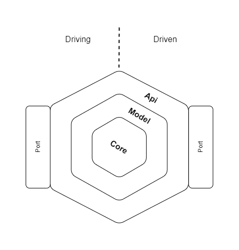

**Integration area** provides public API with method to begin integration process.
Provides also public model, which conains all properties required for specified integration area domain.

Two types of ports (driving and driven) provides abstraction layer for adapters form plugins.
This abstraction covers all required methods for provide data to integration process.
Integration process is invoking in Core layer. There is a heart of integraion.

## Integration area

For define integration area you need to implement `IIntegrationArea` interface:

```csharp "IIntegrationArea"
internal sealed class CustomersIntegrationArea : IIntegrationArea
{
    public string Name => "Customers";

    public void AddIntegrationDependencies(IServiceCollection serviceCollection)
    {
        serviceCollection.AddScoped<ICustomersIntegrationApi, CustomerIntegrationApi>();
        serviceCollection.AddCustomersIntegrationCoreLayer();
    }
}
```
:::note
All integration areas will be loaded automatically druing application start. Only add reference in the starting project is needed.
:::

In Integration area you should registry required dependencies, for that use `AddIntegrationDependencies` method.

## Integration API

Public API has been provided for communication with integration area. It's called `IIntegrationApi`.
```csharp
/// <summary>
/// Interface provide integration API methods
/// </summary>
public interface IIntegrationApi
{
    /// <summary>
    /// Method run integration
    /// </summary>
    Task RunIntegration();
}
```

Best practice for create integration area public API is create marker interface for `IIntegrationApi`.
This interface can be use by the clients applications, like CLI.
```csharp "IIntegrationApi" 
/// <summary>
/// Marker interface for customers integration API
/// </summary>
public interface ICustomersIntegrationApi : IIntegrationApi;
```

## Integration Model

**Integration model** defines public contract of integration area domain which is a base element of communication between ports and plugin's adapters.

```csharp
/// <summary>
/// Interface for represents integration model object 
/// </summary>
public interface IIntegrationModel
{
    /// <summary>
    /// Unique model identifier
    /// </summary>
    Guid Id { get; }
}

```

## Integration Process

Integration process is a main process of integration of specified integration area. Interface `IIntegrationProcess` provides method for execute integration process.

```csharp
/// <summary>
/// Interface provide method for use in integration process
/// </summary>
public interface IIntegrationProcess
{
    /// <summary>
    /// Execute integration process
    /// </summary>
    /// <returns></returns>
    Task ExecuteIntegrationProcess();
}
```

Best practice for create integration process for specified integraion area is create marker interface for `IIntegrationProcess`
```csharp "IIntegrationProcess"
/// <summary>
/// Marker interface for customers integration process
/// </summary>
public interface ICustomersIntegrationProcess : IIntegrationProcess;
```

Implementation of integration process should contains domain logic of integration. 
In example below you can see some integration process of customers. Best practice is attach driving and driven ports here - in integration process, because in this way integration area is focussing only on integration process, not on implementation of external e-commerce systems which shoudl be provided by the plugins.

```csharp
internal sealed class CustomersIntegrationProcess(
    ILogger<CustomersIntegrationProcess> logger,
    ICustomersIntegrationDrivingPort drivingPort,
    ICustomersIntegrationDrivenPort drivenPort) : ICustomersIntegrationProcess
{
    public async Task ExecuteIntegrationProcess()
    {
        logger.LogInformation("Customers integration started");

        var customersCollection = await drivingPort.FetchCollectionAsync();

        logger.LogInformation("Received {count} customers", customersCollection.Count);

        foreach (var customerModel in customersCollection)
        {
            logger.LogInformation("Processing customer with Id: {id}", customerModel.Id);

            if (customerModel.IsActive is not true)
            {
                logger.LogWarning("Customer is not active, skipped");
            }
            
            await drivenPort.PushAsync(customerModel);
        }
    }
}
```
